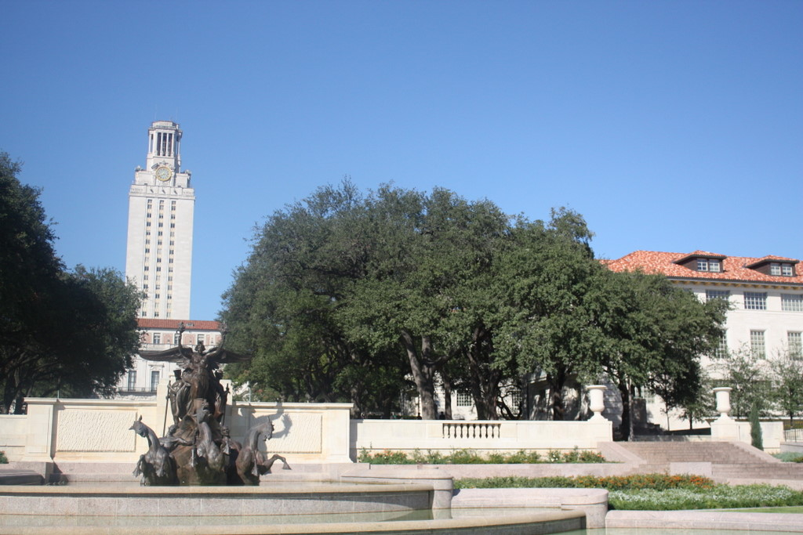

# DeskPanorama-SIFT
A Python implementation to stitch two images into a panorama using SIFT descriptors, homographic projections, and image warping techniques.

### Image 1

### Image 2

### Stitched Image

